# Lighting Test for Unreal Engine 5
The goal is lighting has correctness and neutral.   
Engine Users would be able to use these test scenes to verify that the lighting is correct and neutral for the various Unreal Engine rendering methods.
* Lumen
  * Hardware Ray Tracing (HWRT)
  * Software Ray Tracing (SWRT)
* Screen Space Reflection (SSR)
* Screen Space Global Illumination (SSGI)

# Default Settings
## Rendering
- Global Illumination use Lumen
- Reflection use Lumen
- Use Hardware Ray Tracing when available

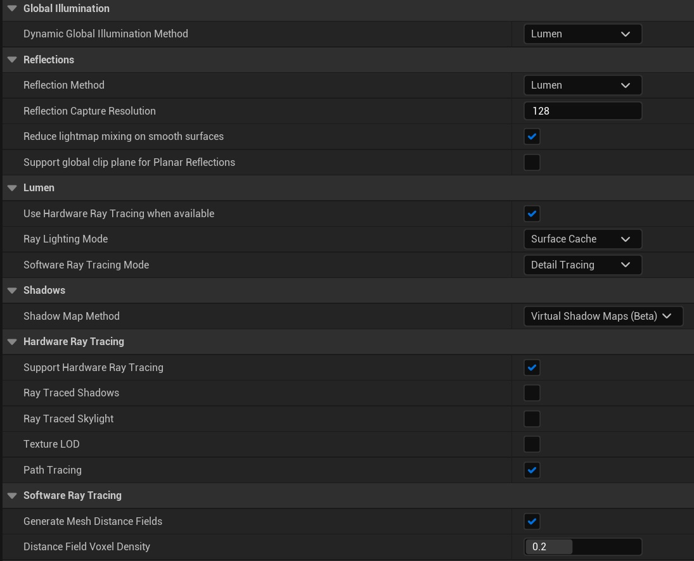 

# Preparation  
## Disable Post Processing on Project Settings
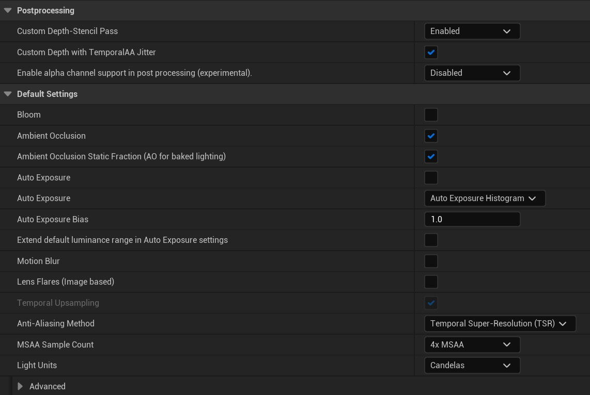 

## Disable All Post Processing on Editor
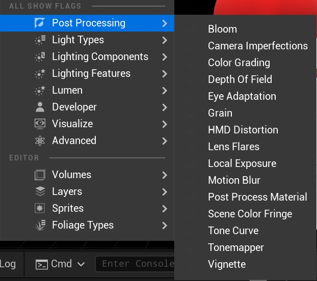 

## Disable Game Setting on Editor
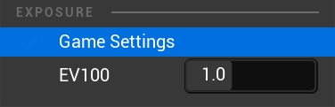 

# References
* [NVIDIA Falcor 5.2 Custom](https://github.com/msgfx/Falcor) Mogwai
  * Script Falcor/Source/Mogwai/Data/PathTracer.py
  * Tonemap is Linear
* [Test Scenes: References/Scenes](References/Scenes)

# Scenes
* Unreal Engine 5.0.3
* There are 4 test scenes
  1. Perfect Lambert Plane
  2. Perfect MirrorPlane
  3. Perfect Mirror Weak White Plane
  4. Glossy Plane

## 1. Perfect Lambert Plane
<table>
<tr>
<th>Reference</th>
<th>Lumen</th>
<th>Path Tracing (UE5)</th>
</tr>
<tr>
<td>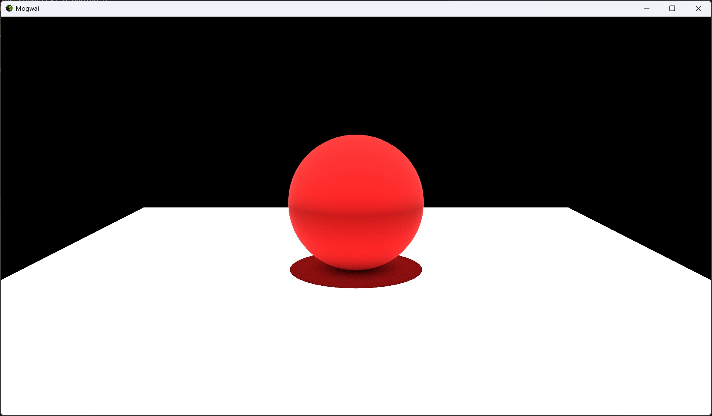</td>
<td>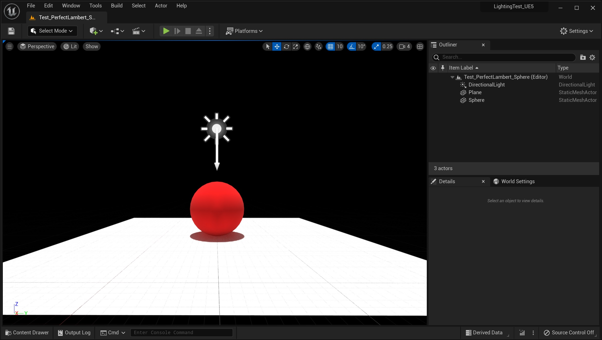</td>
<td></td>
</tr>
<td></td>
<td></td>
<td></td>
</table>

* UE5 - [Content/Maps/Test_PerfectLambert_Sphere.umap](Content/Maps/Test_PerfectLambert_Sphere.umap)
* Reference - [References/Scenes/test_sphere_perfect_lambert.pyscene](References/Scenes/test_sphere_perfect_lambert.pyscene)

### Directional Light
| Property           | Value                |
| ------------------ | -------------------- |
| Intensity          | 10 [lux]             |
| Rotation           | (0, -90, 0) [degree] |

### Sphere Material
| Property           | Value      |
| ------------------ | ---------- |
| Base Color         | (1, 0, 0)  |
| Metalness          | 0.0        |
| Specular Roughness | 1.0        |

### Plane Material
| Property           | Value      |
| ------------------ | ---------- |
| Base Color         | (1, 1, 1)  |
| Metalness          | 0.0        |
| Specular Roughness | 1.0        |

## 2. Perfect Mirror Plane
<table>
<tr>
<th>Reference</th>
<th>Lumen</th>
<th>Path Tracing (UE5)</th>
</tr>
<tr>
<td>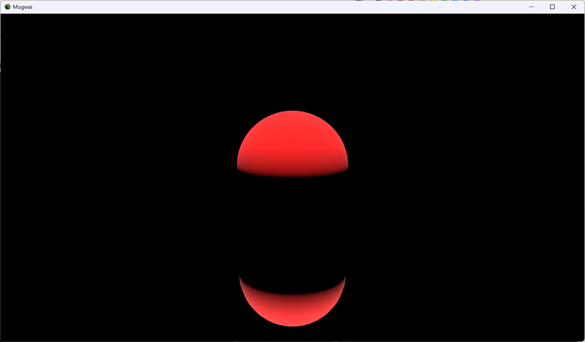</td>
<td></td>
<td>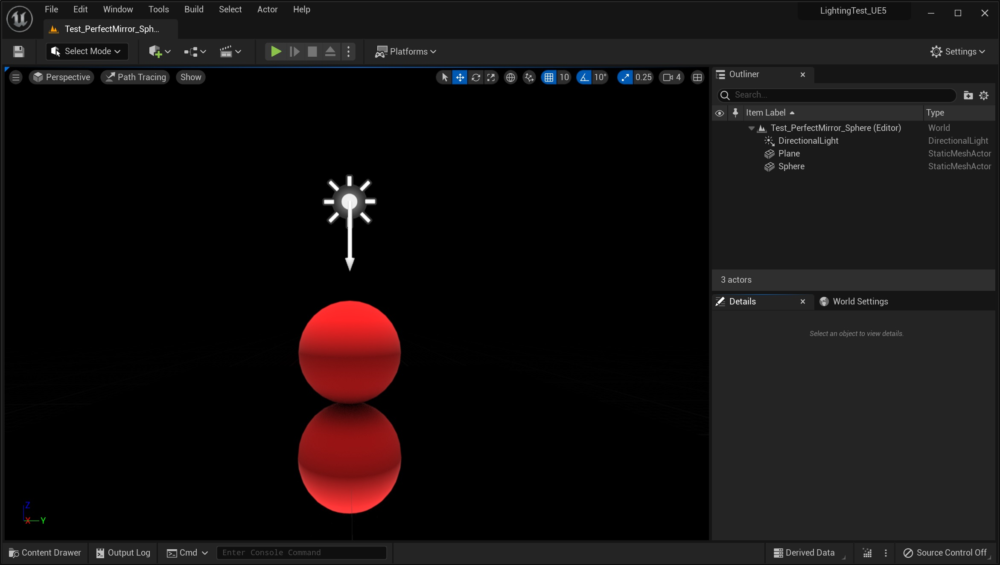</td>
</tr>
<tr>
<td></td>
<td>This looks like mix in diffuse(base color) to mirror plane...</td>
<td>UE5 Path Tracing is also same result...</td>
</tr>
</table>

* UE5 - [Content/Maps/Test_PerfectMirror_Sphere.umap](Content/Maps/Test_PerfectMirror_Sphere.umap)
* Reference - [References/Scenes/test_sphere_perfect_mirror.pyscene](References/Scenes/test_sphere_perfect_mirror.pyscene)
### Directional Light
| Property           | Value                |
| ------------------ | -------------------- |
| Intensity          | 10 [lux]             |
| Rotation           | (0, -90, 0) [degree] |

### Sphere Material
| Property           | Value      |
| ------------------ | ---------- |
| Base Color         | (1, 0, 0)  |
| Metalness          | 0.0        |
| Specular Roughness | 1.0        |

### Plane Material
| Property           | Value      |
| ------------------ | ---------- |
| Base Color         | (1, 1, 1)  |
| Metalness          | 1.0        |
| Specular Roughness | 0.0        |

## 3. Perfect Mirror Weak White Plane
<table>
<tr>
<th>Reference</th>
<th>Lumen</th>
<th>Path Tracing (UE5)</th>
</tr>
<tr>
<td>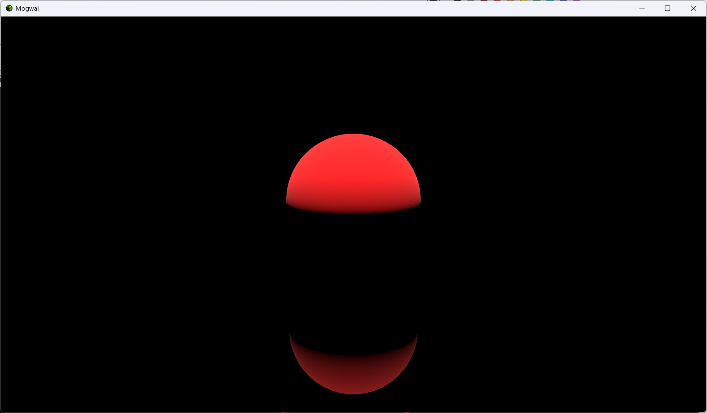</td>
<td>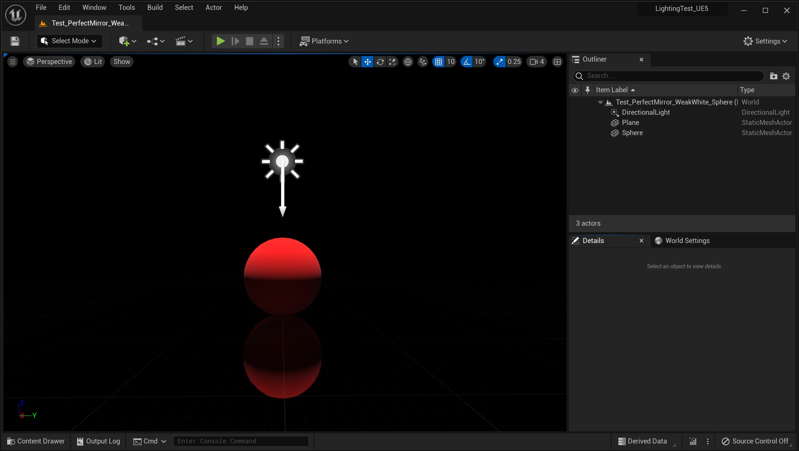</td>
<td>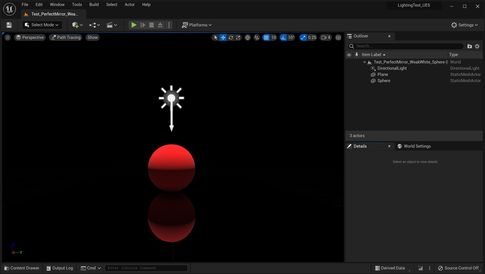</td>
</tr>
<tr>
<td></td>
<td>Making Base Color as close to black as possible   will bring you closer to the reference image. 
However, the reflection of the floor will also be weakened...</td>
<td>UE5 Path Tracing is also same result...</td>
</tr>
</table>

* UE5 - [Content/Maps/Test_PerfectMirror_WeakWhite_Sphere.umap](Content/Maps/Test_PerfectMirror_WeakWhite_Sphere.umap)
* Reference - [References/Scenes/test_sphere_perfect_mirror_base_color_weak_white.pyscene](References/Scenes/test_sphere_perfect_mirror_base_color_weak_white.pyscene)
### Directional Light
| Property           | Value                |
| ------------------ | -------------------- |
| Intensity          | 10 [lux]             |
| Rotation           | (0, -90, 0) [degree] |

### Sphere Material
| Property           | Value      |
| ------------------ | ---------- |
| Base Color         | (1, 0, 0)  |
| Metalness          | 0.0        |
| Specular Roughness | 1.0        |

### Plane Material
| Property           | Value      |
| ------------------ | ---------- |
| Base Color         | (0.1, 0.1, 0.1)  |
| Metalness          | 1.0        |
| Specular Roughness | 0.0        |

## 4. Glossy Plane
<table>
<tr>
<th>Reference</th>
<th>Lumen</th>
<th>Path Tracing (UE5)</th>
</tr>
<tr>
<td>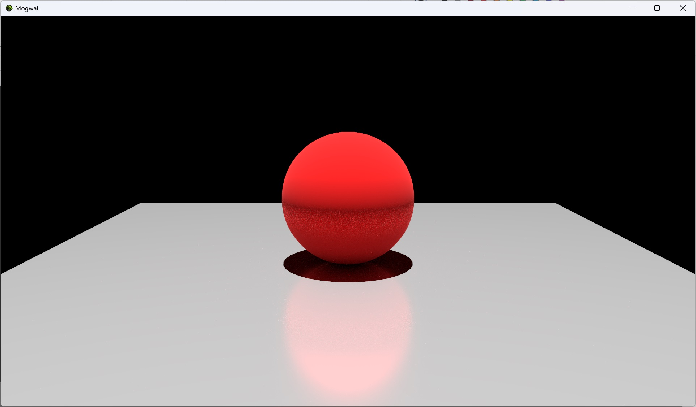</td>
<td>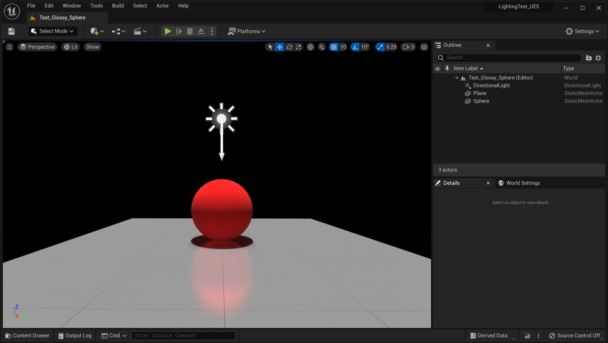</td>
<td>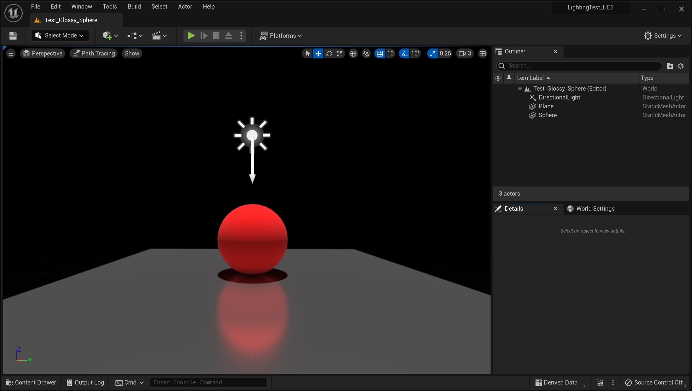</td>
</tr>
<tr>
<td></td>
<td></td>
<td>Plane is dark less than Lumen result...</td>
</tr>
</table>

* UE5 - [Content/Maps/Test_Glossy_Sphere.umap](Content/Maps/Test_Glossy_Sphere.umap)
* Reference - [References/Scenes/test_sphere_glossy_plane.pyscene](References/Scenes/test_sphere_glossy_plane.pyscene)
### Directional Light
| Property           | Value                |
| ------------------ | -------------------- |
| Intensity          | 10 [lux]             |
| Rotation           | (0, -90, 0) [degree] |

### Sphere Material
| Property           | Value      |
| ------------------ | ---------- |
| Base Color         | (1, 0, 0)  |
| Metalness          | 0.0        |
| Specular Roughness | 1.0        |

### Plane Material
| Property           | Value      |
| ------------------ | ---------- |
| Base Color         | (1, 1, 1)  |
| Metalness          | 0.8        |
| Specular Roughness | 0.2        |

# TODO
- Image Based Lighting Tests
- Lighting Complex Scene Tests
- Real-Time Lighting with Dynamic Physics Rigid Body Objects
